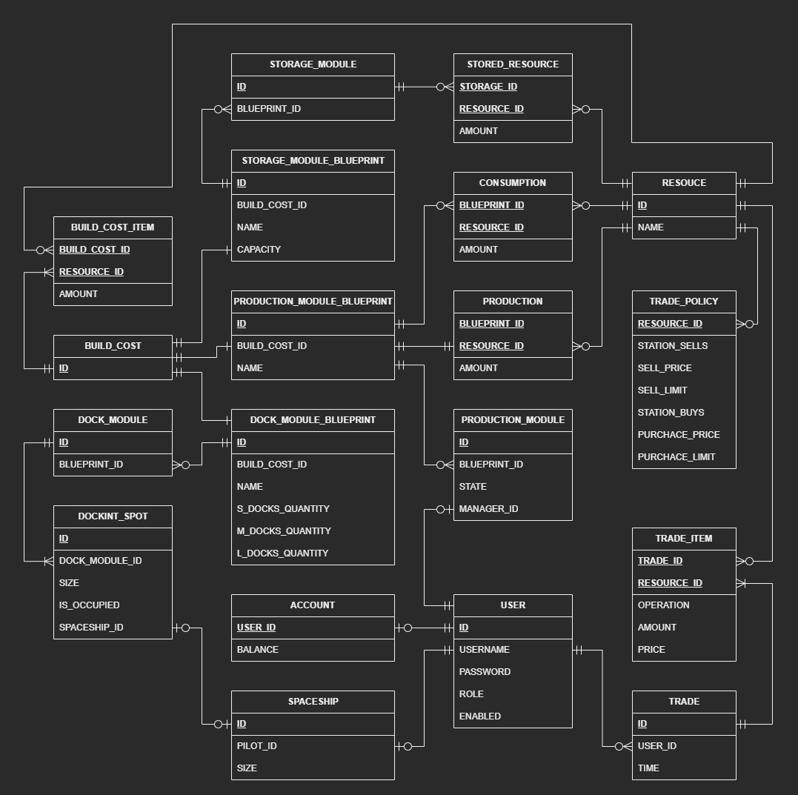
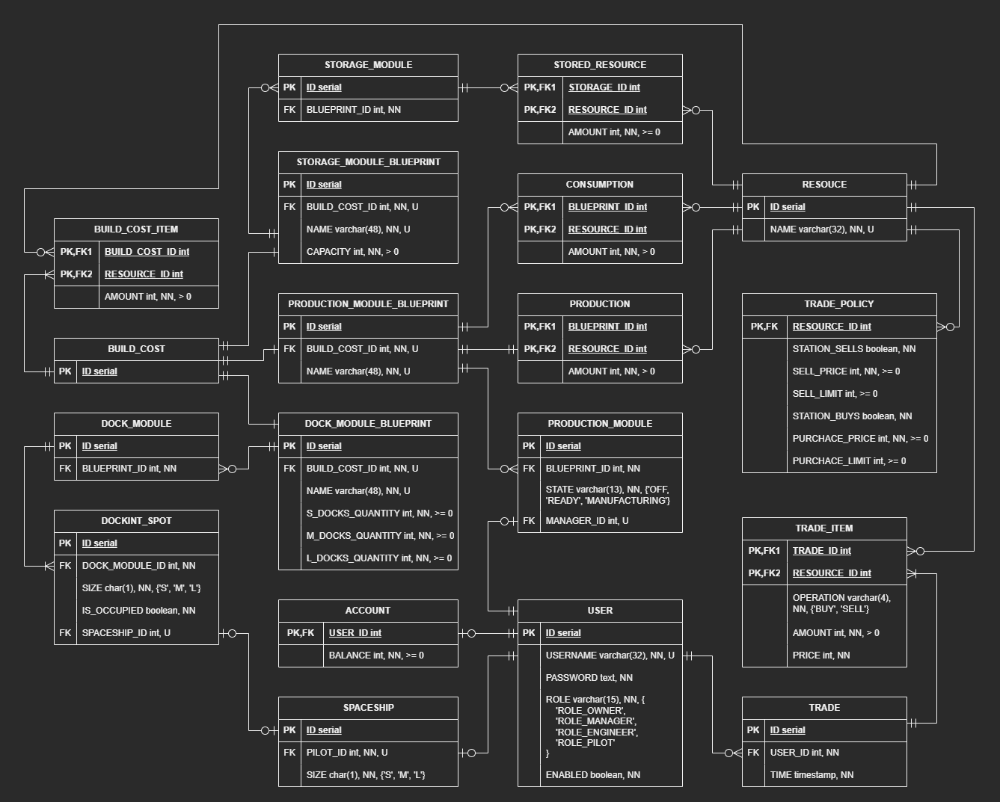
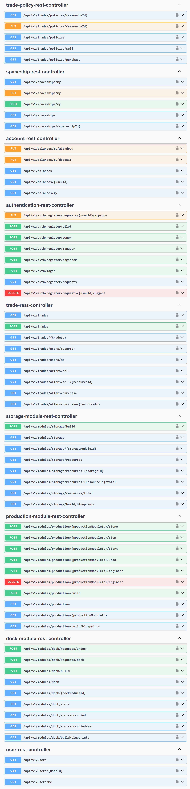

# Информационная система космической станции

## Технологии

**Spring**: Boot, Web, Data JPA, Security + JWT;

FlyWay, SQL, PostgreSQL, Docker, Swagger, Maven

## Описание предметной области

Предметная область представляет собой космическую станцию. 
Назначение станции – производство, хранение и торговля ресурсами. 
Ресурсы – центральное понятие системы, все строится вокруг них.

Станция состоит из модулей. 
Модули бывают трёх типов: 
производственные, стыковочные, хранилища. 
Разные типы модулей имеют разное предназначение. 
Производственные – преобразование одних ресурсов в другие. 
Стыковочные – стыковка кораблей к станции. Складские – хранение ресурсов.
Модули имеют различные характеристики, которые определяются предопределенными чертежами модулей.
Станция может расширяться путем строительства новых модулей. 

Пилоты могут прилетать на своих кораблях на станцию и осуществлять торговлю ресурсами.

## Функции системы

(краткое, неполное ~~и в основном неверное~~ описание)

### Пользователи

Система поддерживает 4 роли пользователей: Владелец, Менеджер, Инженер, Пилот (клиент). 

Система поддерживает регистрацию пилотов и единственного владельца напрямую, 
а также регистрацию инженеров и менеджеров через подачу заявок. 
Владелец и Менеджеры рассматривают заявки и могут одобрять или отклонять их.

После успешной регистрации пользователь получает возможность доступа к системе через JWT-токен.

### Финансовые счета

При регистрации Владельца или Пилота за ним регистрируется финансовый счет.
Владелец счета может пополнить его или вывести с него средства.
Владелец и Менеджеры могут просматривать все финансовые счера.

### Корабли

Пилот может зарегистрировать единственный личный корабль с указанием размера (S, M, L). 
Пилот может изменять зарегистрированный корабль.
Пилот с зарегистрированным кораблем имеет возможность стыковки со станцией.

### Складские модули

Характеристика складского модуля - вместимость.
Владелец и Менеджеры могут просматривать хранимые ресурсы, 
их распределение по складским модулям,
отслеживать остаточную вместимость складских модулей.

### Производственные модули

Характеристики производственного модуля - потребляемые и производимые ресурсы
за производственный цикл.
Управлением производстенных модулей занимаются Инженеры.
Владелец и Менеджеры могут назначать и снимать Инженера на производственный модуль.

Производственный модуль может находиться в одном из 3 состояний: Off, Ready, Manufactoring.
Последние два состояния разрешены только при наличии приписанного Инженера.
Владелец и Менеджеры могут включать и выключать производственные модули.
приписанного Инженера.
Инженер может начать производственный цикл, 
при этом из складских модулей выгрузятся необходимые ресурсы.
После начала производственного цикла Инженер может его закончить,
при этом произведенные ресурсы будут загружены в складские модули.

### Стыковочные модули

Характеристика стыковочного модуля - количество посадочных мест для кораблей различных размеров (S, M, L).
Пилот может отправить запрос на стыковку,
при этом ему будет выделено свободное посадочное место,
соответствующее размеру его корабля.
Пилот с пристыкованным кораблем может отстыковаться,
при этом его посадочное место освободится.

### Строительство модулей

Система предоставляет Владельцу и Менеджерам доступ к фиксированному набору чертежей модулей станции.
Владелец и Менеджеры могут инициировать строительство нового модуля
по выбранному чертежу, если в хранилищах станции достаточно ресурсов.
Владелец и Менеджеры могут просматривать состояние всех модулей станции.

### Торговые политики

Владелец и Менеджеры могут изменять торговую политику для каждого ресурса.
Торговая политика определяет, торгует ли станция этим ресурсом (покупает/продает), 
цены продажи/покупки, а так же лимины на операции:
какое количество ресурса станция будет всегда удерживать на складе 
и до какого предельного количества станция будет этот ресурс покупать.

### Торговля

Пользователи могут просматривать торговые предложения станции,
вычисленные на основе торговых политик и наличии ресурсов в складских модулях.
Пилоты с пристыкованными кораблями могут торовать ресурсами со станцией
в рамках действующих торговых предложений. 
При заключении сделок денежные стредства переводятся между счетами Пилота и Владельца.
Система хранит информацию о завершённых торговых операциях, включая детали 
(что куплено, что продано, когда, кем и в каком количестве).

## База данных

### Инфологическая модель

### Даталогическая модель (PostgreSQL)

## API

### Swagger
